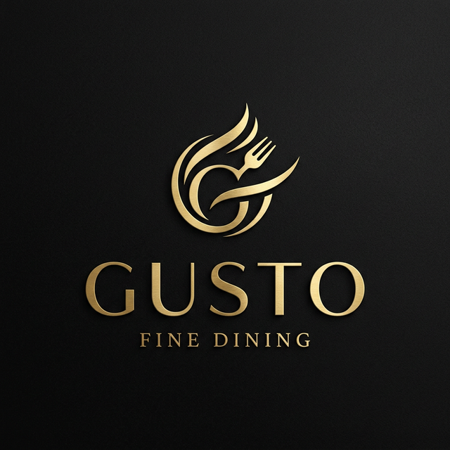

# GUSTO - Premium Restaurant Management System



GUSTO is a modern, high-end full-stack restaurant management application designed to provide a seamless experience for both customers and administrators. Built with a focus on premium aesthetics and responsive design, GUSTO offers a complete digital solution for contemporary dining establishments.

## 🚀 Teck Stack

### Frontend (Client & Admin Dashboard)
- **React 19**: Modern UI development with functional components and hooks.
- **Vite**: Ultra-fast build tool and development server.
- **React Router DOM 7**: Advanced routing and navigation management.
- **Bootstrap 5 & Vanilla CSS**: Premium, responsive styling with a dark-gold aesthetic.
- **React Icons**: Comprehensive iconography for an intuitive user experience.
- **Axios**: Promised-based HTTP client for seamless API integration.

### Backend (Server)
- **Node.js & Express 5**: Robust and scalable server-side architecture.
- **MongoDB & Mongoose 9**: Flexible and powerful NoSQL database management.
- **JSON Web Token (JWT)**: Secure authentication and session management.
- **BcryptJS**: Industry-standard password hashing for user security.
- **CORS & Dotenv**: Secure cross-origin resource sharing and environment management.

## ✨ Core Features

### 🍽️ Culinary Experience
- **Dynamic Menu**: Browsable menu with high-quality, local dish imagery.
- **Signature Dishes**: Featured items like *Tandoori Chicken Delight* and *Royal Gulab Jamun*.
- **Local Asset Management**: High-resolution dish photography hosted locally for 100% reliability.

### 📱 Responsive Design
- **Mobile First**: Fully optimized for smartphones, tablets, and desktops.
- **Fluid Layouts**: Responsive typography and section spacing using CSS variables.
- **Animated Dashboard**: Slide-in mobile sidebar with smooth transitions and backdrop overlays.

### 🔒 User & Admin Portals
- **Secure Authentication**: Dedicated Login and Registration systems for both customers and administrators.
- **Customer Dashboard**: Access to booking history, profile management, and favorites.
- **Admin Panel**: Comprehensive oversight of the food menu, reservations, messages, and user details.
- **Real-time Stats**: Responsive data grids and stat cards for quick business insights.

### 📅 Reservation System
- **Booking Engine**: Interactive reservation forms for customers.
- **Management**: Admin-facing reservation tracking and status updates.

## 🛠️ Installation & Setup

1. **Clone the repository**:
   ```bash
   git clone https://github.com/User16-03/Restaurant-.git
   ```

2. **Install dependencies**:
   - For Client: `cd client && npm install`
   - For Dashboard: `cd dashboard && npm install`
   - For Server: `cd server && npm install`

3. **Environment Configuration**:
   Create a `.env` file in the `server` directory with your `MONGO_URI` and `JWT_SECRET`.

4. **Seed the Database**:
   ```bash
   node server/seedDishes.js
   ```

5. **Start Development Servers**:
   - Client: `npm run dev` (inside client folder)
   - Dashboard: `npm run dev` (inside dashboard folder)
   - Server: `npm start` (inside server folder)

---
*Created with ❤️ for GUSTO - Elevating the Dining Experience.*
